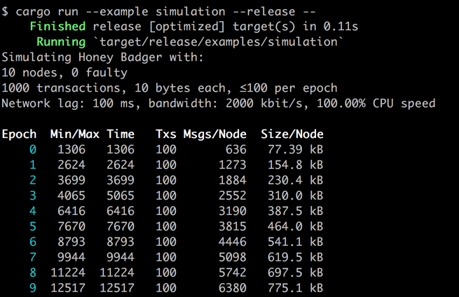

# Honey Badger Byzantine Fault Tolerant (BFT) consensus algorithm

[](https://travis-ci.com/poanetwork/hbbft) 
[](https://gitter.im/poanetwork/hbbft?utm_source=badge&utm_medium=badge&utm_campaign=pr-badge)

Welcome to a [Rust](https://www.rust-lang.org/en-US/) library of the Honey Badger Byzantine Fault Tolerant (BFT) consensus algorithm. The research and protocols for this algorithm are explained in detail in "[The Honey Badger of BFT Protocols](https://eprint.iacr.org/2016/199.pdf)" by Miller et al., 2016.

Following is an overview of HoneyBadger BFT and [basic instructions for getting started](#getting-started). 

_**Note:** This library is a work in progress and parts of the algorithm are still in development._

## What is Honey Badger?
The Honey Badger consensus algorithm allows nodes in a distributed, potentially asynchronous environment to achieve agreement on transactions. The agreement process does not require a leader node, tolerates corrupted nodes, and makes progress in adverse network conditions. Example use cases are decentralized databases and blockchains.

Honey Badger is **Byzantine Fault Tolerant**. The protocol can reach consensus with a number of failed nodes f (including complete takeover by an attacker), as long as the total number N of nodes is greater than 3 * f.

Honey Badger is **asynchronous**.  It does not make timing assumptions about message delivery. An adversary can control network scheduling and delay messages without impacting consensus.

## How does it work?
Honey Badger is a modular library composed of several independent algorithms.  To reach consensus, Honey Badger proceeds in epochs. In each epoch, participating nodes broadcast a set of encrypted data transactions to one another and agree on the contents of those transactions. 

In an optimal networking environment, output includes data sent from each node. In an adverse environment, the output is an agreed upon subset of data. Either way, the resulting output contains a batch of transactions which is guaranteed to be consistent across all nodes.  

In addition to **validators**, the algorithms support **observers**: These don't actively participate, and don't need to be trusted, but they receive the output as well, and are able to verify it under the assumption that more than two thirds of the validators are correct.

## Algorithms

- [x] **[Honey Badger](https://github.com/poanetwork/hbbft/blob/master/src/honey_badger.rs):** Each node inputs transactions. The protocol outputs a sequence of batches of transactions.

- [ ] **[Dynamic Honey Badger](https://github.com/poanetwork/hbbft/blob/master/src/dynamic_honey_badger.rs):** A modified Honey Badger where nodes can dynamically add and remove other nodes to/from the network.

- [x] **[Subset](https://github.com/poanetwork/hbbft/blob/master/src/common_subset.rs):** Each node inputs data. The nodes agree on a subset of suggested data. 

- [x] **[Broadcast](https://github.com/poanetwork/hbbft/blob/master/src/broadcast.rs):** A proposer node inputs data and every node receives this output.

- [x] **[Binary Agreement](https://github.com/poanetwork/hbbft/blob/master/src/agreement/mod.rs):** Each node inputs a binary value. The nodes agree on a value that was input by at least one correct node. 

- [x] **[Coin](https://github.com/poanetwork/hbbft/blob/master/src/common_coin.rs):** A pseudorandom binary value used by the Binary Agreement protocol.

- [x] **[Synchronous Key Generation](https://github.com/poanetwork/hbbft/blob/master/src/sync_key_gen.rs)** A dealerless algorithm that generates keys for threshold encryption and signing. Unlike the other algorithms, this one is _completely synchronous_ and should run on top of Honey Badger (or another consensus algorithm)

## Getting Started

This library requires a distributed network environment to function. Details on network requirements TBD. 

_**Note:** Additional examples are currently in progress._

### Build

Requires `rust` and `cargo`: [installation instructions.](https://www.rust-lang.org/en-US/install.html)

```
$ cargo build [--release]
```

### Test

```
$ cargo test --release
```

### Example Network Simulation

A basic [example](https://github.com/poanetwork/hbbft/blob/master/examples/README.md) is included to run a network simulation.

```
$ cargo run --example simulation --release
```



|  Heading    | Definition                       
| ----------- | -------------------------------------------------------------------------- | 
| Epoch       |  Epoch number. In each epoch, transactions are processed in a batch by simulated nodes (default is 10 nodes) on a network. The batch is always output in one piece, with all transactions at once.                                                           | 
| Min Time   | Time in simulated milliseconds until the first correct (i.e. not faulty) node outputs the batch.                                          |  
| Max Time   | Time in simulated milliseconds until the last correct node outputs the batch.                                                  |  
| Txs         | Number of transactions processed in the epoch.                                           |  
| Msgs/Node   | Average number of messages handled by a node. The counter is cumulative and includes the number of messages handled in the current epoch and all previous epochs.                                                               |  
| Size/Node   | Average message size (in converted bytes) handled by a node. This is cumulative and includes message size for the current epoch and all previous epochs.                                                             |  
 

#### Options

Set different parameters to simulate different transaction and network conditions.

|  Flag                  | Description                         | 
| ---------------------- | -------------------------------- | 
| `-h, --help`            | Show help options                   | 
| `--version`             | Show the version of hbbft |  
| `-n <n>, --nodes <n>`   | The total number of nodes [default: 10]        |  
| `-f <f>, --faulty <f>`  | The number of faulty nodes [default: 0]|  
| `-t <txs>, --txs <txs>` | The number of transactions to process [default: 1000]                     |  
| `-b <b>, --batch <b>`   | The batch size, i.e. txs per epoch [default: 100]                    |  
|  `-l <lag>, --lag <lag>` | The network lag between sending and receiving [default: 100]                     |  
|  `--bw <bw>`             | The bandwidth, in kbit/s [default: 2000]                    |  
|  `--cpu <cpu>`           | The CPU speed, in percent of this machine's [default: 100]                     |  
|  `--tx-size <size>`      | The size of a transaction, in bytes [default: 10]                     |  


**Examples:**

```bash
# view options
$ cargo run --example simulation --release -- -h

# simulate a network with 12 nodes, 2 of which are faulty
$ cargo run --example simulation --release -- -n 12 -f 2

# increase batch size to 500 transactions per epoch
$ cargo run --example simulation --release -- -b 500

```


## Current TODOs

See [Issues](https://github.com/poanetwork/hbbft/issues) for all tasks.

- [ ] Dynamic Honey Badger (adding and removing nodes in a live network environment) ([#47](https://github.com/poanetwork/hbbft/issues/47#issuecomment-394640406))
- [ ] Create additional adversarial scenarios and tests
- [ ] Networking example to detail Honey Badger implementation

## Protocol Modifications

Our implementation modifies the protocols described in "[The Honey Badger of BFT Protocols](https://eprint.iacr.org/2016/199.pdf)" in several ways:
*  We use a [pairing elliptic curve library](https://github.com/ebfull/pairing) to implement pairing-based cryptography rather than Gap Diffie-Hellman groups. 
* We add a `Terminate` message to the Binary Agreement algorithm. Termination occurs following output, preventing the algorithm from running (or staying in memory) indefinitely. ([#53](https://github.com/poanetwork/hbbft/issues/55))
*  We add a `Conf` message to the Binary Agreement algorithm. An additional message phase prevents an attack if an adversary controls a network scheduler and a node. ([#37](https://github.com/poanetwork/hbbft/issues/37))
*  We return additional information from the Subset and Honey Badger algorithms that specifies which node input which data. This allows for identification of potentially malicious nodes.
* We include a Distributed Key Generation (DKG) protocol which does not require a trusted dealer; nodes collectively generate a secret key. This addresses the problem of single point of failure. See [Distributed Key Generation in the Wild](https://eprint.iacr.org/2012/377.pdf).

### Algorithm naming conventions  

We have simplified algorithm naming conventions from the original paper.

|  Algorithm Name  | Original Name                    | 
| ---------------- | -------------------------------- | 
| Honey Badger     | HoneyBadgerBFT                   | 
| Subset           | Asynchronous Common Subset (ACS) |  
| Broadcast        | Reliable Broadcast (RBC)         |  
| Binary Agreement | Binary Byzantine Agreement (BBA) |  
| Coin             | Common Coin                      |  

## Contributing

See the [CONTRIBUTING](CONTRIBUTING.md) document for contribution, testing and pull request protocol.

## License

[](https://www.gnu.org/licenses/lgpl-3.0)

This project is licensed under the GNU Lesser General Public License v3.0. See the [LICENSE](LICENSE) file for details.

## References

* [The Honey Badger of BFT Protocols](https://eprint.iacr.org/2016/199.pdf)

* [Honey Badger Video](https://www.youtube.com/watch?v=Qone4j1hCt8)

* Other language implementations

  * [Python](https://github.com/amiller/HoneyBadgerBFT)

  * [Go](https://github.com/anthdm/hbbft)

  * [Erlang](https://github.com/helium/erlang-hbbft)

  * [Rust](https://github.com/rphmeier/honeybadger) - unfinished implementation
